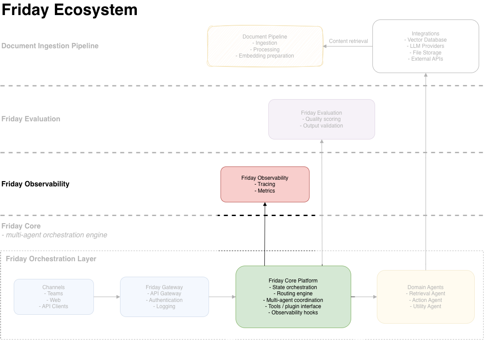

# 📊 Friday Observability

*Monitoring, metrics & dashboards for AI agents*

<p align="left">
  <a href="https://github.com/theaiintegrators"></a>
  
  
  
  
</p>

------------------------------------------------------------------------

## 🌟 Overview

**Friday Observability** provides metrics, dashboards and Prometheus
integration for:

-   AI agents
-   orchestration systems
-   LLM tools
-   multi-agent workflows

------------------------------------------------------------------------

## 📘 Friday Observability



------------------------------------------------------------------------

## ✨ Features

-   Real-time Prometheus metrics
-   Auto-provisioned Grafana dashboards
-   Dockerized stack
-   Latency, throughput & error analytics
-   Extensible metrics emitter

------------------------------------------------------------------------

## 🏛 Architecture

    Agents → Metrics Emitter → Prometheus → Grafana Dashboards

------------------------------------------------------------------------

## 📚 Repository Structure

    friday-observability/
      ├── docker-compose.yml
      ├── prometheus.yml
      ├── grafana/
      ├── emit_metrics.py
      ├── LICENSE
      └── README.md

------------------------------------------------------------------------

## 🚀 Quick Start

``` bash
git clone https://github.com/theaiintegrators/friday-observability
cd friday-observability

docker compose up -d
```

Grafana → http://localhost:3000
user: admin / pass: admin

------------------------------------------------------------------------

## 🧭 Roadmap

-   MCP tool integration
-   Parallel execution patterns
-   Workflow visualizer
-   LangFuse auto-enrichment
-   Built‑in safety evaluators
-   Friday CLI
-   Deployment templates

------------------------------------------------------------------------

## 🔭 Vision

Friday aims to make AI systems:

-   **Predictable**
-   **Testable**
-   **Observable**
-   **Enterprise-ready**

With a code-first, extensible design that scales from prototypes to full
production platforms.

------------------------------------------------------------------------

## 📄 License

MIT License
Copyright © 2025
The AI Integrators

------------------------------------------------------------------------

## 💬 Contact & Contributions

-   Open an Issue or Discussion
-   PRs welcome
-   https://github.com/theaiintegrators